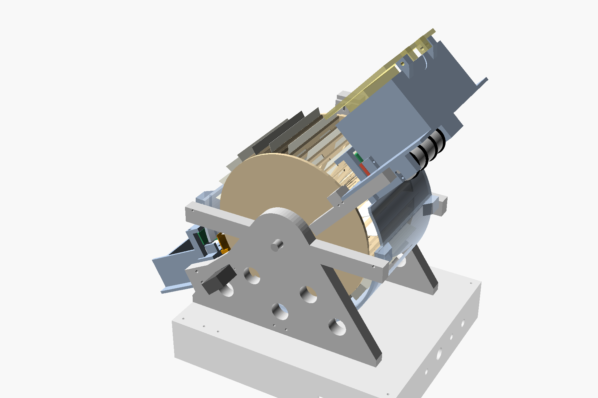

# Open card shuffler — 54-slot wheel, 3D-printed, battery powered

A one-button shuffler for one 52–54 card poker deck. Cards are fed one at a
time into a uniformly random empty slot of a 54-slot wheel, then the wheel
is emptied in slot order into a chute. Assigning each card to a random
empty slot is the Fisher–Yates algorithm, so every ordering of the deck is
exactly equally likely when the mechanism does what it is told, and the
firmware checks each insertion with a sensor so that the ways it can fail
are logged, not hidden.

**Status: complete design, unbuilt.** Nothing here has been printed, wired
or tested on hardware. Every performance number is an estimate and is
labelled as such. This machine is not proven, not production-ready and not
guaranteed uniformly random; the validation plan says how to earn those
words.



The first iteration (elevator + separator blades, exact but slower) is kept
complete in `archive/v1-elevator-insertion/`.

## What is here

| Deliverable | Where |
|---|---|
| Mechanism comparison and selection | `docs/01-mechanism-selection.md` |
| Mathematics: uniformity proof, RNG, fault analysis, riffle theory, validation plan | `docs/02-mathematics.md` |
| Simulation and results | `simulation/shuffle_sim.py`, `simulation/results/`; animated shuffle `simulation/wheel_sim.html` (open in a browser) |
| Bit-exact RNG reference, physical-test analysis | `simulation/rng_reference.py`, `simulation/analyze_physical.py` |
| Parametric CAD, 24 STL files (print list in `cad/print-settings.md`), views, collision and printability checks | `cad/params.scad`, `cad/shuffler.scad`, `cad/stl/`, `cad/png/`, `cad/check_clearance.sh`, `cad/check_printability.py` |
| Mechanical design document | `docs/03-mechanical-design.md`, `cad/print-settings.md` |
| Electronics, battery, wiring, pins | `docs/04-electronics.md`, `electronics/wiring-diagram.svg` |
| Bill of materials | `docs/05-bom.md`, `electronics/bom.csv` |
| Firmware (ESP32, Arduino) | `firmware/` |
| Assembly, calibration, first use | `docs/06-assembly.md` |
| Operation, maintenance, troubleshooting | `docs/07-operation-maintenance-troubleshooting.md` |
| Verification checklist, prototype plan | `docs/08-verification-checklist.md`, `docs/09-prototype-plan.md` |
| Gaps and unknowns | `docs/10-deliverables-and-gaps.md` |
| Diagrams | `docs/img/` |

## Headline numbers (estimates unless stated)

| | |
|---|---|
| Parts cost, excluding printing | ≈ $114 new; ≈ $96 with a parts drawer; ≈ $88 minimum |
| Cycle time, 52 cards | 40–45 s first build; 28–32 s tuned (target 30 s: within reach, not promised) |
| Randomness | exact uniform in the ideal model (proof §2.2); symmetric slot errors provably harmless with the firmware's map correction; biased errors measured by the machine's own log |
| Size | ≈ 298 × 231 mm footprint (under 12 × 12 in), ≈ 331 mm tall |
| Battery | 3S Li-ion 2200 mAh with BMS; ≈ 0.05 Wh per shuffle |
| Cards | 52–54, thickness 0.22–0.42 mm |

## Quick start for a builder

1. Read `docs/01` and `docs/03`.
2. Follow `docs/09-prototype-plan.md` (feeder first, wheel second).
3. Print with `cad/print-settings.md`, buy from `docs/05`, wire from
   `electronics/wiring-diagram.svg`, flash `firmware/`, calibrate with
   `docs/06` §6.7, verify with `docs/08`.

## Reproducing the analysis

```
pip install numpy scipy
python3 simulation/shuffle_sim.py --quick
python3 simulation/rng_reference.py --selftest
cd firmware/test_host && make run && ./syntax_check.sh
cd cad && ./render.sh && ./check_clearance.sh   # OpenSCAD 2021.01 + xvfb-run
pip install trimesh shapely scipy networkx rtree && python3 check_printability.py
```

## Licence

CC BY 4.0 (documentation, CAD), MIT (code). No warranty; see the safety
notes in `docs/07`.
